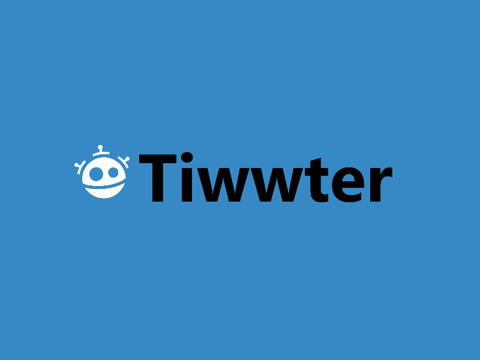
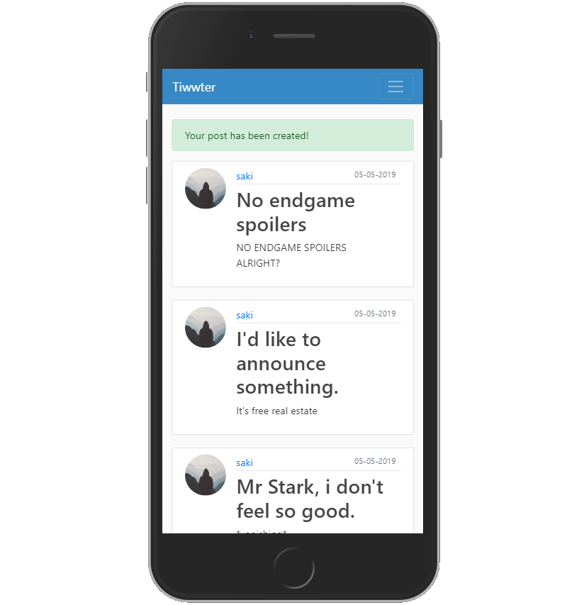
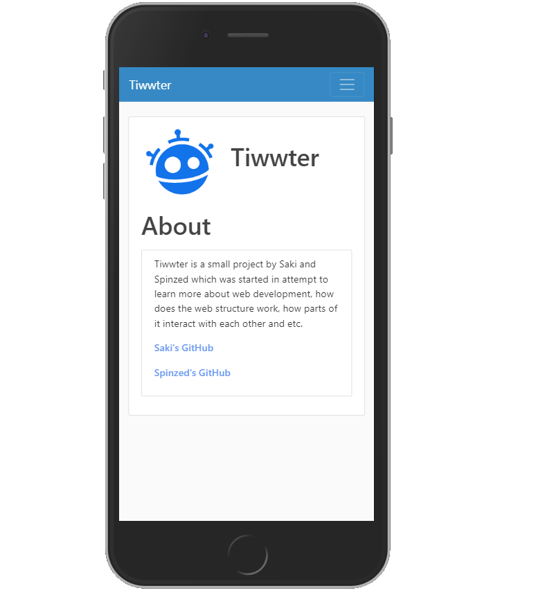
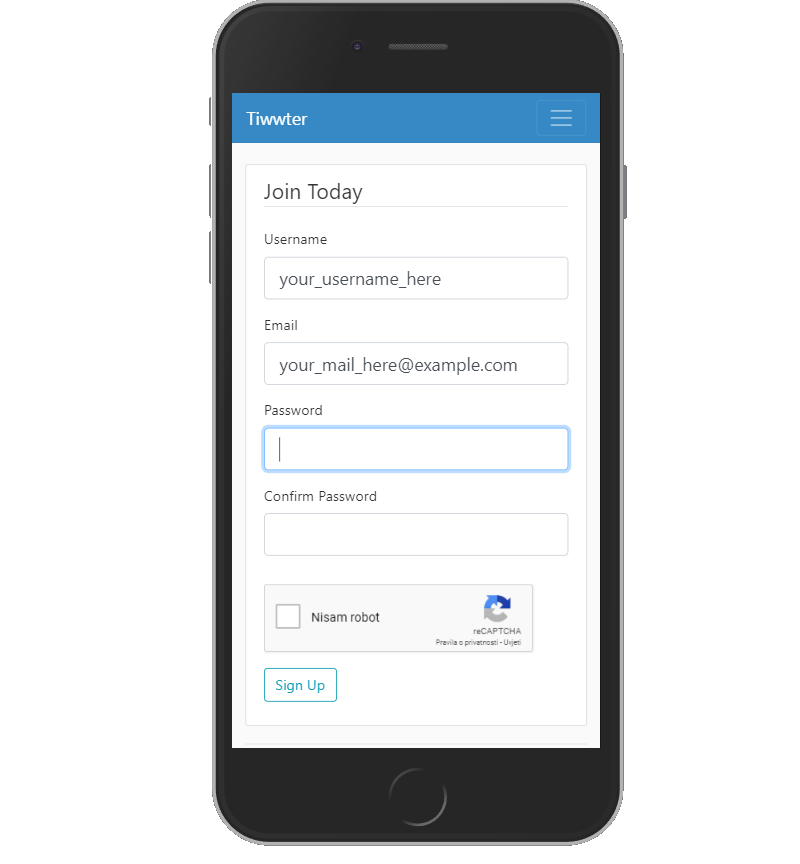

# <center>  <center>
# <center> Tiwwter - Fake Twitter <center>
<center> A little CRUD post-based website built to replace dying Facebook <center>

## Motivation
 This project started as a way to learn Flask web framework, but evolved in something bigger. We are still running into some issues, so feel free to add them to the issues list.

## Build Status
We are very close to intergrating Travis CI so expect build status soon.

## Screenshots
| Feeds | Profile |
|:-:|:-:|
|  |  |

| About | Register |
|:-:|:-:|
|  |  |

## Tech / Frameworks Used
* [Python 3.6 (although versions above 3.6 work too)](https://www.python.org)
* [Flask - Python micro-framework for web development](http://flask.pocoo.org/)
* [flask_sqlalchemy - SQLAlchemy adaptation to work with Flask web apps](http://flask.pocoo.org/docs/1.0/patterns/sqlalchemy/)
* [gunicorn - Python WSGI HTTP Server ](https://gunicorn.org/)
* [psycopg2 - Binary necessary for SQLAlchemy to work with PostgreSQL](https://pypi.org/project/psycopg2/)

Other addons are referenced in [requirements.txt](https://github.com/isakal/Tiwwter/blob/master/requirements.txt)

## Code Example / API Reference
This web app is package-like structured. That means that every single package/service has its folder in `~/app/` directory and `__init__.py` within its folder. Also, those service are initialized in `~/app/__init__.py` both outside and inside function `create_app()`.<br>
 E.g. error handling is made as its own service/package and it has its own directory `~/app/errors/`. As you can see, `__init__.py` file can be empty. It's there just to signalize the interpreter it's a package. After making it's own separate folder, initialize the package/service in `~/app/__init__.py`.
```cpp
.
|-- LICENSE
|-- Procfile
|-- README.md
|-- app
|   |-- __init__.py
|   |-- errors
|   |   |-- __init__.py
|   |   `-- handlers.py
|   `-- models.py
|
|-- empty_create_db.py
|-- keys.json
|-- manage.py
|-- requirements.txt

```


To make your own service/package, follow this:


```python
# ~/app/__init__.py
from flask import Flask

app = Flask(__name__)
service = YourService(app) # app is the flask object that is running
service.init_app() # initializing the package/service once the app starts

#...

def create_app(): # this function is being ran in run.py which starts the server

    app = Flask(__name__)
    service.init_app()
    return app
```


If you are creating new blueprint, please follow this :


```python
#~/app/your_blueprint/routes.py
from flask Blueprint

bp = Blueprint('bp',__name__) # see flask docs to search for other arguments of the Blueprint object
@bp.route("/")
def some_func():
    return render_template('some_file.html')


```


```python
# ~/app/__init__.py
from flask import Flask

app = Flask(__name__)
#services are initialized here
from app.your_blueprint import bp # bp is a name of a blueprint you make

app.register_blueprint(bp)

#...

def create_app(): # this function is being ran in run.py which the starts the server

    app = Flask(__name__)
    #services are initialized here
    from app.your_blueprint import bp # bp is a name of a blueprint you make

    app.register_blueprint(bp)

    return app
```
## Tests
Tests are still done manually. **:)**<br>
That will be changed when Travis CI gets implemented.

## How To Use?
To run your own instance of Tiwwter locally, you will have to set some things up first.<br>
```python
#~/app/__init__.py

#...
app.config['MAIL_USERNAME'] = os.environ['TIWWTER_MAIL']
app.config['MAIL_PASSWORD'] = os.environ['TIWWTER_PASSWORD']
app.config['SQLALCHEMY_DATABASE_URI'] = os.environ['TIWWTER_DB_URI']
#...
```
As you can see, we need some environment variables. First two aren't needed if you don't want/need mail service to work. Third one is needed if you actually want to run your website locally.<br>
It's URI for the database. It can be either postgres or sqlite. <br>

Then run type this in your terminal of choice:
```bash
pip install -r requirements.txt
python empty_create_db.py
python run.py
```
This snippet is pretty much self-explanitory. We install dependencies, run a script that sets our database with all the correct tables and at the end we run the server.

For this, Python version 3.6 or everything above is good.

##  Contributing [](https://github.com/isakal/Tiwwter/issues)

We use a mixture of pylint and flake8 for linting. To contribute, fork this repo, add yourself to contributors list, make changes and submit PR.
Feel free to open issues, we are glad to hear feedback.

## Credits
Good job if you read till here! We would like to give credits to some very important people. Such as Corey Schafer and my CS teacher. Corey has a great youtube series explaining how flask works which you can visit [here](https://www.youtube.com/playlist?list=PL-osiE80TeTs4UjLw5MM6OjgkjFeUxCYH).<br>
Pallets Projects are the creators of Flask and modules that Flask is based on. I recommend visiting their discord server [here](https://discord.gg/7g9bd9g).

## LICENSE
[MIT](https://choosealicense.com/licenses/mit/) © Saki
